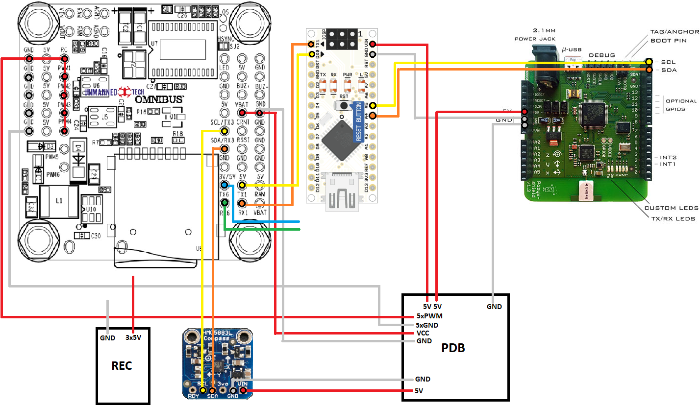

# Autonomous-Drones
## Pinout:

## Architektur für Kommunikation:

## LiPos Laden:
* Ladestärke 5A 
* 11.1V 
* LiPo (3S für 3 Zellen) 
* "Start" gedrükt halten bis es piept
* "Enter" zur Bestätigung der Einstellungen drücken

## POZYX Channel Settings
ultra-wideband channel 5, preamble length 1024, prf 64MHz, and bitrate 110kbps

## POZYX Anchor-IDs:
* 0x6951 - 1500mm
* 0x6e59 - 2000mm
* 0x695d - 2500mm
* 0x690b - 3000mm

## APROXIMATE GPS COORDINATES OF LAB
> 51.311644, 9.473625 (51°18'41.9"N 9°28'25.1"E)

## Useful Links:

[Ardupilot with Pozyx](http://ardupilot.org/copter/docs/common-pozyx.html)

[Drone not arming issues](https://github.com/iNavFlight/inav/wiki/%22Something%22-is-disabled----Reasons)

[iNAV GPS and COMPASS setup](https://github.com/iNavFlight/inav/wiki/GPS--and-Compass-setup)

[Omnibus F4 board infos](https://github.com/iNavFlight/inav/blob/master/docs/Board%20-%20Omnibus%20F4.md)

[Identify Omnibus F4 board](https://www.dronetrest.com/t/how-to-identify-what-omnibus-f4-board-you-have/4735)

## Info
* Arduino Nano Flash: old bootloader

## Verkabelung

### POZYX -> Arduino Nano
* SDA -> SDA (Pin A4)
* SCL -> SCL (Pin A5)
* GND -> GND

### PDB -> POZYX 
* GND -> GND
* 5V -> 5V

### PDB -> FC
* 5Pin-PWM (Motoren) -> 5Pin-PWM
* 5Pin-GND -> 5Pin-GND
* VCC -> VBAT
* GND -> GND

### PDB -> Arduino Nano
* 5V -> Vin

### FC -> Arduino Nano
* RX1 -> TX1
* TX1 -> RX0

### FC -> REC
* 3Pin-GND -> GND
* 5V -> 3Pin-5V

